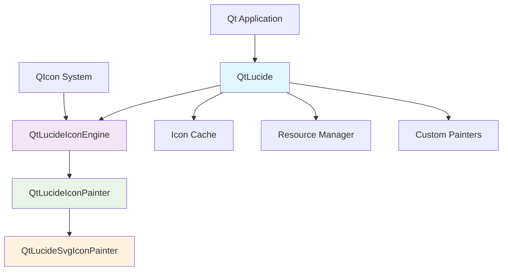

# Development Guide

Comprehensive guide for developers who want to contribute to QtLucide or build it from source.

## Overview

This section covers everything you need to know about QtLucide development, from building the library to contributing new features.

<div class="grid cards" markdown>

-   :material-hammer-wrench: **Building from Source**

    ---

    Complete instructions for building QtLucide on all supported platforms.

    [:octicons-arrow-right-24: Building Guide](building.md)

-   :material-account-group: **Contributing**

    ---

    Guidelines for contributing code, documentation, and examples to QtLucide.

    [:octicons-arrow-right-24: Contributing](contributing.md)

-   :material-test-tube: **Testing**

    ---

    Information about the test suite, running tests, and writing new tests.

    [:octicons-arrow-right-24: Testing](testing.md)

-   :material-tools: **Tools & Scripts**

    ---

    Development tools and scripts for icon processing and code generation.

    [:octicons-arrow-right-24: Tools](tools.md)

</div>

## Development Environment Setup

### Prerequisites

- **Qt 6.0+** with development headers
- **CMake 3.16+** for building
- **C++17 compiler** (GCC 7+, Clang 5+, MSVC 2017+)
- **Python 3.6+** for development scripts
- **Git** for version control

### Quick Setup

```bash
# Clone the repository
git clone https://github.com/AstroAir/QtLucide.git
cd QtLucide

# Create development build
mkdir build-dev && cd build-dev
cmake .. -DCMAKE_BUILD_TYPE=Debug \
         -DQTLUCIDE_BUILD_EXAMPLES=ON \
         -DQTLUCIDE_BUILD_TESTS=ON

# Build everything
cmake --build . --parallel

# Run tests
ctest --output-on-failure
```

## Project Structure

```
QtLucide/
├── CMakeLists.txt              # Main CMake configuration
├── README.md                   # Project overview
├── LICENSE                     # MIT license
├── CHANGELOG.md               # Version history
├── CONTRIBUTING.md            # Contribution guidelines
├── SECURITY.md                # Security policy
├── Doxyfile                   # Doxygen configuration
├── QtLucide.pri              # qmake integration
├── cmake/                     # CMake modules
│   └── QtLucideConfig.cmake.in
├── include/                   # Public headers
│   └── QtLucide/
│       ├── QtLucide.h
│       ├── QtLucideIconEngine.h
│       ├── QtLucideIconPainter.h
│       ├── QtLucideEnums.h
│       └── QtLucideStrings.h
├── src/                       # Implementation
│   ├── CMakeLists.txt
│   ├── QtLucide.cpp
│   ├── QtLucideIconEngine.cpp
│   └── QtLucideIconPainter.cpp
├── resources/                 # Icon resources
│   └── icons/
│       └── *.svg
├── examples/                  # Example applications
│   ├── basic_usage/
│   └── gallery/
├── tests/                     # Test suite
│   ├── CMakeLists.txt
│   ├── main.cpp
│   └── test_*.cpp
├── tools/                     # Development tools
│   ├── build_resources.py
│   ├── generate_headers.py
│   ├── generate_qrc.py
│   └── process_lucide_icons.py
└── docs/                      # Documentation
    └── *.md
```

## Architecture Overview

### Core Components



### Key Design Principles

1. **Performance First**: Efficient caching and lazy loading
2. **Qt Integration**: Native Qt patterns and conventions
3. **Extensibility**: Plugin system for custom painters
4. **Type Safety**: Strong typing with enums and compile-time checks
5. **Memory Efficiency**: Automatic resource management

## Development Workflow

### 1. Feature Development

```bash
# Create feature branch
git checkout -b feature/new-feature

# Make changes
# ... edit code ...

# Build and test
cmake --build build-dev
ctest --test-dir build-dev

# Commit changes
git add .
git commit -m "Add new feature: description"

# Push and create PR
git push origin feature/new-feature
```

### 2. Icon Updates

```bash
# Update Lucide icons
cd tools
python process_lucide_icons.py --update

# Regenerate resources
python build_resources.py
python generate_headers.py

# Test changes
cd ../build-dev
cmake --build .
./QtLucideTests
```

### 3. Documentation Updates

```bash
# Edit documentation
# ... edit docs/*.md ...

# Build documentation locally
mkdocs serve

# View at http://localhost:8000
```

## Code Style Guidelines

### C++ Style

We follow Qt's coding conventions with some additions:

```cpp
// Class names: PascalCase
class QtLucideIconEngine : public QIconEngine
{
    Q_OBJECT

public:
    // Method names: camelCase
    explicit QtLucideIconEngine(QtLucide* lucide);
    
    // Public methods documented with Doxygen
    /**
     * @brief Creates a pixmap for the given parameters
     * @param size Desired pixmap size
     * @param mode Icon mode (Normal, Disabled, etc.)
     * @param state Icon state (Off, On)
     * @return Rendered pixmap
     */
    QPixmap pixmap(const QSize& size, QIcon::Mode mode, 
                   QIcon::State state) override;

private:
    // Member variables: m_ prefix
    QtLucide* m_lucide;
    QVariantMap m_options;
    
    // Private methods: camelCase
    QString generateCacheKey(const QSize& size, QIcon::Mode mode, 
                           QIcon::State state) const;
};
```

### CMake Style

```cmake
# Variables: UPPER_CASE
set(QTLUCIDE_VERSION_MAJOR 1)
set(QTLUCIDE_VERSION_MINOR 0)

# Functions: snake_case
function(qtlucide_add_resources target)
    # Implementation
endfunction()

# Targets: PascalCase
add_library(QtLucide SHARED ${SOURCES})
```

### Python Style

Follow PEP 8 for Python scripts:

```python
"""Module for processing Lucide icons."""

import os
import json
from pathlib import Path
from typing import List, Dict, Optional


class IconProcessor:
    """Processes Lucide SVG icons for QtLucide."""
    
    def __init__(self, source_dir: Path, output_dir: Path):
        """Initialize the processor.
        
        Args:
            source_dir: Directory containing source SVG files
            output_dir: Directory for processed output
        """
        self.source_dir = source_dir
        self.output_dir = output_dir
    
    def process_icons(self) -> List[str]:
        """Process all icons and return list of processed names."""
        # Implementation
        pass
```

## Testing Strategy

### Unit Tests

Test individual components in isolation:

```cpp
class TestQtLucide : public QObject
{
    Q_OBJECT

private slots:
    void initTestCase();
    void testInitialization();
    void testIconCreation();
    void testCustomColors();
    void testCaching();
    void cleanupTestCase();

private:
    lucide::QtLucide* m_lucide;
};
```

### Integration Tests

Test component interactions:

```cpp
void TestIntegration::testIconEngineIntegration()
{
    lucide::QtLucide lucide;
    QVERIFY(lucide.initLucide());
    
    QIcon icon = lucide.icon("heart");
    QVERIFY(!icon.isNull());
    
    // Test that icon engine works correctly
    QPixmap pixmap = icon.pixmap(32, 32);
    QVERIFY(!pixmap.isNull());
    QCOMPARE(pixmap.size(), QSize(32, 32));
}
```

### Performance Tests

Measure performance characteristics:

```cpp
void TestPerformance::testIconCreationSpeed()
{
    lucide::QtLucide lucide;
    lucide.initLucide();
    
    QElapsedTimer timer;
    timer.start();
    
    // Create 1000 icons
    for (int i = 0; i < 1000; ++i) {
        QIcon icon = lucide.icon("heart");
    }
    
    qint64 elapsed = timer.elapsed();
    qDebug() << "Created 1000 icons in" << elapsed << "ms";
    
    // Should be fast due to caching
    QVERIFY(elapsed < 100);  // Less than 100ms
}
```

## Release Process

### Version Numbering

QtLucide uses semantic versioning (SemVer):

- **Major** (X.0.0): Breaking API changes
- **Minor** (1.X.0): New features, backward compatible
- **Patch** (1.0.X): Bug fixes, backward compatible

### Release Checklist

1. **Update version numbers**
   - CMakeLists.txt
   - Documentation
   - Package files

2. **Update CHANGELOG.md**
   - New features
   - Bug fixes
   - Breaking changes

3. **Run full test suite**
   - All platforms
   - All Qt versions
   - Performance tests

4. **Update documentation**
   - API changes
   - New examples
   - Migration guides

5. **Create release**
   - Git tag
   - GitHub release
   - Package artifacts

## Debugging Tips

### Common Issues

**Icons not displaying**
```cpp
// Check initialization
if (!lucide.initLucide()) {
    qDebug() << "QtLucide initialization failed";
}

// Check icon existence
QStringList available = lucide.availableIcons();
if (!available.contains("my-icon")) {
    qDebug() << "Icon 'my-icon' not found";
}
```

**Performance problems**
```cpp
// Enable debug output
QLoggingCategory::setFilterRules("qtlucide.cache.debug=true");

// Check cache statistics
qDebug() << "Cache size:" << lucide.cacheSize();
qDebug() << "Cache hits:" << lucide.cacheHits();
```

### Development Tools

**Qt Creator Integration**
- Use Qt Creator's CMake support
- Enable Clang Code Model for better IntelliSense
- Configure custom build steps for resource generation

**Debugging with GDB/LLDB**
```bash
# Debug build with symbols
cmake .. -DCMAKE_BUILD_TYPE=Debug

# Run with debugger
gdb ./QtLucideTests
(gdb) run
```

## Community

### Getting Help

- **GitHub Discussions**: General questions and ideas
- **GitHub Issues**: Bug reports and feature requests
- **Code Review**: All changes reviewed by maintainers
- **Documentation**: Keep docs updated with code changes

### Recognition

Contributors are recognized in:
- CONTRIBUTORS.md file
- Release notes
- Documentation credits
- GitHub contributor graphs

## What's Next?

Ready to contribute? Check out:

- [Building Guide](building.md) - Set up your development environment
- [Contributing Guidelines](contributing.md) - Learn how to contribute
- [Testing Guide](testing.md) - Understand our testing approach
- [Tools Documentation](tools.md) - Master the development tools
