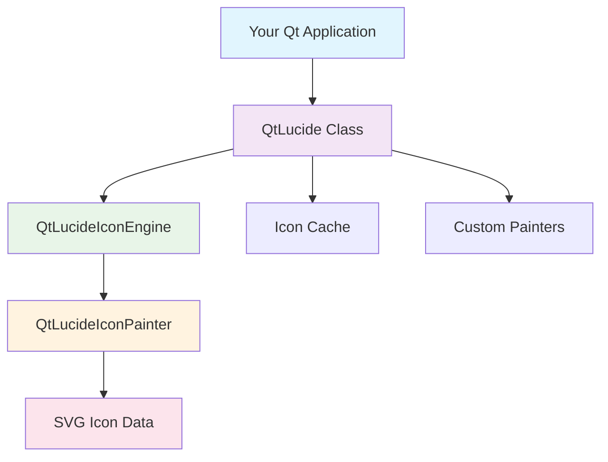

# Getting Started with QtLucide

Welcome to QtLucide! This section will help you get up and running with beautiful Lucide icons in your Qt applications.

## What You'll Learn

In this getting started guide, you'll learn how to:

- Install QtLucide in your development environment
- Set up your first Qt project with QtLucide
- Create and customize icons
- Integrate QtLucide into existing projects

## Prerequisites

Before you begin, make sure you have:

- **Qt 6.0 or later** installed on your system
- **CMake 3.16 or later** for building from source
- **C++17 compatible compiler** (GCC 7+, Clang 5+, MSVC 2017+)
- **Python 3.6+** (optional, for building from source)

## Quick Overview

QtLucide provides access to over 1,634 beautiful Lucide icons through a simple, Qt-native API. Here's what makes it special:

### 🎨 Beautiful Icons
All icons from the Lucide icon set, rendered as crisp SVG graphics that scale perfectly at any size.

### ⚡ High Performance
Efficient caching and optimized rendering ensure your application stays responsive.

### 🔧 Easy Integration
QtAwesome-compatible API makes migration simple, while new features provide enhanced functionality.

### 🎯 Customizable
Runtime color changes, scaling, opacity, and custom painters for advanced use cases.

## Architecture Overview

QtLucide consists of several key components:

- **QtLucide**: Main class that manages icons and provides the public API
- **QtLucideIconEngine**: QIconEngine implementation for efficient rendering
- **QtLucideIconPainter**: Extensible painter system for custom rendering
- **Icon Cache**: Automatic caching for optimal performance

## Next Steps

Choose your path based on your needs:

-   :material-download: **Installation**

    ---

    Install QtLucide using your preferred method - CMake, package managers, or build from source.

    [:octicons-arrow-right-24: Installation Guide](installation.md)

-   :material-rocket-launch: **Quick Start**

    ---

    Get your first QtLucide icon working in under 5 minutes.

    [:octicons-arrow-right-24: Quick Start](quick-start.md)

-   :material-school: **First Steps**

    ---

    Detailed walkthrough of creating your first QtLucide application.

    [:octicons-arrow-right-24: First Steps](first-steps.md)

-   :material-book-open: **User Guide**

    ---

    Comprehensive guide to all QtLucide features and capabilities.

    [:octicons-arrow-right-24: User Guide](../user-guide/index.md)

## Common Use Cases

QtLucide is perfect for:

### Desktop Applications
Add professional-looking icons to toolbars, menus, buttons, and status indicators.

### Cross-Platform Projects
Single codebase works across Windows, macOS, and Linux with consistent appearance.

### Modern UI Design
Lucide's clean, modern design language fits perfectly with contemporary application designs.

### High-DPI Displays
SVG-based rendering ensures crisp icons on all display densities.

## Support & Community

Need help getting started?

- **Documentation**: Complete guides and API reference
- **Examples**: Working code examples for common scenarios
- **GitHub Issues**: Report bugs or request features
- **Discussions**: Community Q&A and best practices

---

Ready to begin? Start with the [Installation Guide](installation.md) or jump straight to the [Quick Start](quick-start.md) if you're eager to see QtLucide in action!
