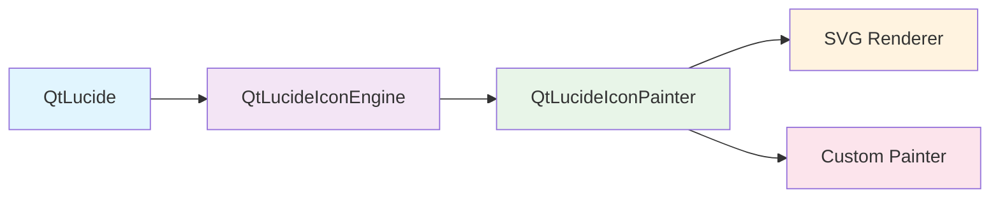

# User Guide

Welcome to the comprehensive QtLucide User Guide! This section covers everything you need to know to effectively use QtLucide in your Qt applications.

## What's Covered

This user guide is organized into focused sections that build upon each other:

<div class="grid cards" markdown>

-   :material-play-circle-outline: **Basic Usage**

    ---

    Learn the fundamentals of creating and using icons in your Qt applications.

    [:octicons-arrow-right-24: Basic Usage](basic-usage.md)

-   :material-palette-outline: **Icon Customization**

    ---

    Master color customization, scaling, and visual effects for your icons.

    [:octicons-arrow-right-24: Customization](customization.md)

-   :material-rocket-launch-outline: **Advanced Features**

    ---

    Explore custom painters, caching strategies, and performance optimization.

    [:octicons-arrow-right-24: Advanced Features](advanced-features.md)

-   :material-speedometer: **Performance Tips**

    ---

    Best practices for optimal performance in icon-heavy applications.

    [:octicons-arrow-right-24: Performance](performance.md)

</div>

## Key Concepts

Before diving into the details, let's understand the core concepts that make QtLucide powerful:

### Icon Management

QtLucide uses a centralized approach to icon management:

```cpp
lucide::QtLucide lucide;
lucide.initLucide();  // Initialize the icon system

// Icons are created on-demand and cached automatically
QIcon homeIcon = lucide.icon("home");
QIcon settingsIcon = lucide.icon("settings");
```

### Customization System

Icons can be customized using a flexible options system:

```cpp
QVariantMap options;
options["color"] = QColor(Qt::red);
options["scale-factor"] = 1.2;
options["opacity"] = 0.8;

QIcon customIcon = lucide.icon("heart", options);
```

### Painter Architecture

QtLucide uses an extensible painter system for rendering:



## Icon Categories

QtLucide includes 1,634+ icons organized into logical categories:

### Navigation & UI
- **Navigation**: `home`, `arrow-left`, `arrow-right`, `menu`
- **Actions**: `save`, `edit`, `delete`, `copy`, `paste`
- **Status**: `check`, `x`, `alert-circle`, `info`

### Content & Media
- **Files**: `file`, `folder`, `image`, `video`
- **Media Controls**: `play`, `pause`, `stop`, `volume-2`
- **Communication**: `mail`, `phone`, `message-circle`

### Business & Productivity
- **Calendar**: `calendar`, `clock`, `timer`
- **Finance**: `dollar-sign`, `credit-card`, `trending-up`
- **Tools**: `settings`, `tool`, `wrench`

### Social & Sharing
- **Social**: `heart`, `star`, `thumbs-up`, `share`
- **Users**: `user`, `users`, `user-plus`
- **Network**: `wifi`, `globe`, `link`

## Common Patterns

### Application Menus

```cpp
QMenu* fileMenu = menuBar()->addMenu("File");
fileMenu->addAction(lucide.icon("file-plus"), "New");
fileMenu->addAction(lucide.icon("folder-open"), "Open");
fileMenu->addAction(lucide.icon("save"), "Save");
```

### Toolbars

```cpp
QToolBar* toolbar = addToolBar("Main");
toolbar->addAction(lucide.icon("edit"), "Edit");
toolbar->addAction(lucide.icon("trash-2"), "Delete");
toolbar->addAction(lucide.icon("settings"), "Settings");
```

### Status Indicators

```cpp
QLabel* statusIcon = new QLabel();
QVariantMap options;
options["color"] = isConnected ? Qt::green : Qt::red;
statusIcon->setPixmap(lucide.icon("wifi", options).pixmap(16, 16));
```

### Buttons with Context

```cpp
// Success button
QVariantMap successOptions;
successOptions["color"] = QColor(34, 197, 94);  // Green
QPushButton* successBtn = new QPushButton("Success");
successBtn->setIcon(lucide.icon("check-circle", successOptions));

// Warning button
QVariantMap warningOptions;
warningOptions["color"] = QColor(251, 146, 60);  // Orange
QPushButton* warningBtn = new QPushButton("Warning");
warningBtn->setIcon(lucide.icon("alert-triangle", warningOptions));

// Error button
QVariantMap errorOptions;
errorOptions["color"] = QColor(239, 68, 68);  // Red
QPushButton* errorBtn = new QPushButton("Error");
errorBtn->setIcon(lucide.icon("x-circle", errorOptions));
```

## Design Guidelines

### Color Consistency

Use consistent color schemes throughout your application:

```cpp
// Define your application's color palette
const QColor PRIMARY_COLOR(59, 130, 246);    // Blue
const QColor SUCCESS_COLOR(34, 197, 94);     // Green
const QColor WARNING_COLOR(251, 146, 60);    // Orange
const QColor ERROR_COLOR(239, 68, 68);       // Red
const QColor NEUTRAL_COLOR(107, 114, 128);   // Gray

// Set default colors
lucide.setDefaultOption("color", NEUTRAL_COLOR);
lucide.setDefaultOption("color-disabled", NEUTRAL_COLOR.lighter(150));
```

### Size Guidelines

Use appropriate icon sizes for different contexts:

- **Menu items**: 16x16 pixels
- **Toolbar buttons**: 24x24 or 32x32 pixels
- **Large buttons**: 48x48 pixels
- **Status indicators**: 16x16 pixels

```cpp
// Toolbar icons
QVariantMap toolbarOptions;
toolbarOptions["scale-factor"] = 1.5;  // 24px from 16px base
toolbar->addAction(lucide.icon("save", toolbarOptions), "Save");

// Large button icons
QVariantMap largeOptions;
largeOptions["scale-factor"] = 3.0;  // 48px from 16px base
bigButton->setIcon(lucide.icon("play", largeOptions));
```

### Accessibility

Consider accessibility when choosing icons and colors:

```cpp
// Ensure sufficient contrast
QVariantMap accessibleOptions;
accessibleOptions["color"] = QColor(0, 0, 0);  // High contrast
accessibleOptions["scale-factor"] = 1.2;       // Slightly larger

// Always provide text labels
QAction* action = new QAction(lucide.icon("save", accessibleOptions), "Save Document");
action->setStatusTip("Save the current document to disk");
```

## Integration Patterns

### With Qt's Model/View Framework

```cpp
class IconModel : public QAbstractListModel
{
private:
    lucide::QtLucide* m_lucide;
    QStringList m_iconNames;

public:
    QVariant data(const QModelIndex& index, int role) const override
    {
        if (role == Qt::DecorationRole) {
            return m_lucide->icon(m_iconNames.at(index.row()));
        }
        return QVariant();
    }
};
```

### With Custom Widgets

```cpp
class IconButton : public QPushButton
{
private:
    lucide::QtLucide* m_lucide;
    QString m_iconName;
    QColor m_iconColor;

public:
    void setIconName(const QString& name) {
        m_iconName = name;
        updateIcon();
    }

    void setIconColor(const QColor& color) {
        m_iconColor = color;
        updateIcon();
    }

private:
    void updateIcon() {
        QVariantMap options;
        options["color"] = m_iconColor;
        setIcon(m_lucide->icon(m_iconName, options));
    }
};
```

## What's Next?

Now that you understand the fundamentals, dive deeper into specific topics:

1. **[Basic Usage](basic-usage.md)** - Start with the essentials
2. **[Customization](customization.md)** - Learn to style your icons
3. **[Advanced Features](advanced-features.md)** - Explore powerful features
4. **[Performance](performance.md)** - Optimize for speed and memory

Each section builds upon the previous one, so we recommend following them in order if you're new to QtLucide.
